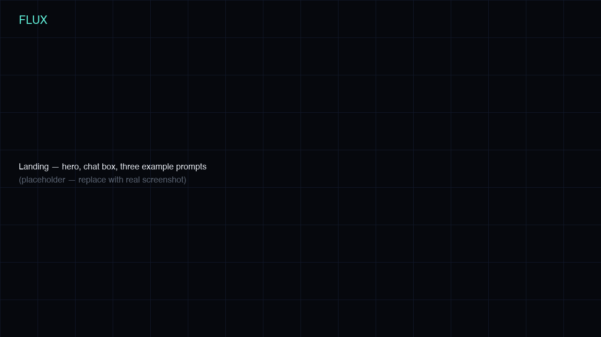
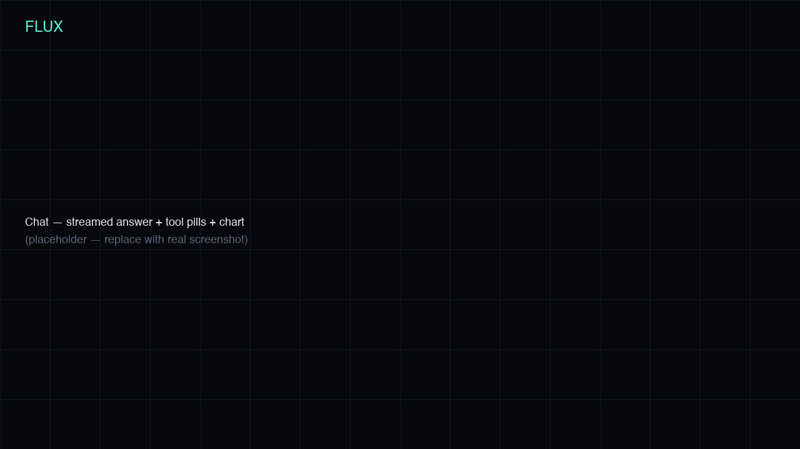
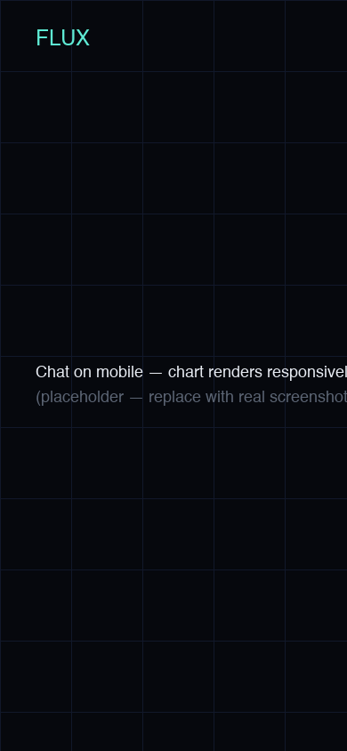
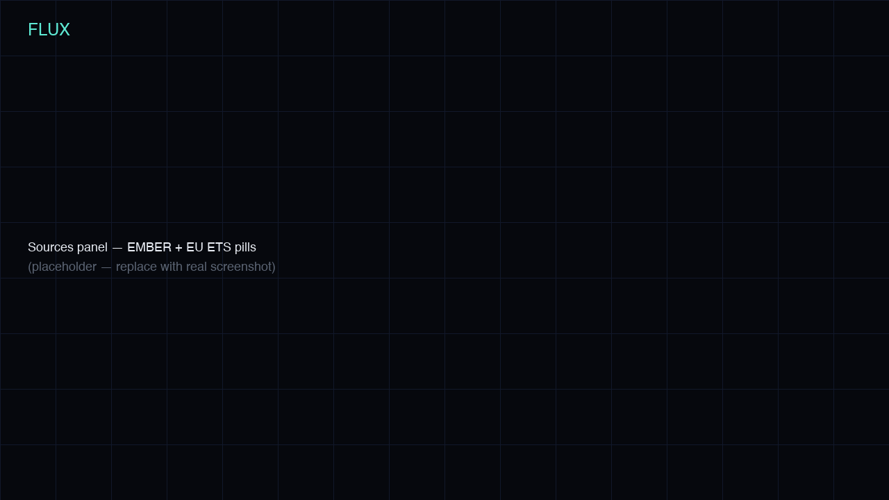

<div align="center">

# Flux

**Talk to the grid.** Plain-English questions about the EU power mix and emissions, answered with streamed prose, live charts, and citations grounded in EMBER + EU ETS data.

[](https://github.com/defnalk/flux/actions/workflows/ci.yml)
[](./LICENSE)
[](https://nextjs.org)
[](https://www.anthropic.com)



*(Replace the screenshots in `docs/screenshots/` with the real captures once recorded — or run `uv run --with pillow python docs/screenshots/make-placeholders.py` to regenerate the placeholders.)*

</div>

## Why

Public energy data is rich but hard to query. Flux lets anyone ask *"how did Germany's coal share change since 2015?"* and get a streamed answer with a chart and EMBER + EU ETS citations — no SQL, no spreadsheet wrangling, no signup.

## What it does

- **Grounded answers** — Claude (`claude-sonnet-4-6`) plans tool calls against a 1.4 MB SQLite snapshot of EMBER yearly electricity (31 European countries, 25 years, 7 fuels) plus a curated EU ETS sector CSV. Numbers come from the data, not the model.
- **Auto-generated charts** — `make_chart` returns a typed spec; the UI renders line, stacked-area, or bar via Recharts in the Flux palette.
- **Always cited** — every tool call emits a source pill that links back to EMBER or the European Commission.
- **Works without an API key** — set `ANTHROPIC_API_KEY` for the full Claude tool-use loop, or skip it and the demo path returns a fully grounded canned answer (real SQL, templated prose) so reviewers can try it immediately.

## Stack

| Layer    | Tech                                                                                        |
| -------- | ------------------------------------------------------------------------------------------- |
| Frontend | Next.js 16 (App Router, Turbopack), React 19, TypeScript, Tailwind 4, Motion, Recharts      |
| Backend  | Next.js Route Handler (Node runtime), `node:sqlite` (stdlib), Anthropic SDK                 |
| Data     | EMBER yearly electricity (CC BY 4.0) + curated EU ETS seed                                  |
| ETL      | Python 3.12, uv-managed, pandas, pytest                                                     |
| Infra    | GitHub Actions (CI, monthly ETL refresh, release tag), Vercel                               |

## Quickstart

```bash
git clone https://github.com/defnalk/flux.git
cd flux
make data                              # download EMBER, write web/data/flux.sqlite + eu_ets.csv
cd web && npm install && npm run dev
```

Open <http://localhost:3000>. Without an API key set, you'll see the demo path; drop your key in `web/.env.local` for the live tool-calling chat.

```bash
# web/.env.local
ANTHROPIC_API_KEY=sk-ant-…
```

## Architecture

```
                  user question
                       │
                       ▼
              /chat?q=…  (App Router, server-rendered shell, client streaming hook)
                       │
                       │  POST /api/ask  {question}
                       ▼
              Node route handler
                       │
                       │  Anthropic SDK · claude-sonnet-4-6 · tool-use loop
                       │  (system prompt + tool defs cached via cache_control)
                       │
        ┌──────────────┼──────────────┬──────────────┐
        ▼              ▼              ▼              ▼
  get_generation_mix  get_emissions  get_policy_   make_chart
        │              │             summary           │
        ▼              ▼              │                ▼
  node:sqlite      eu_ets.csv     canned briefs   ChartSpec (typed)
        │              │              │                │
        └──────────────┴──────────────┴────────────────┘
                       │
                       │  text deltas, tool_use, chart, citation, done
                       ▼  (Server-Sent Events)
              Conversation component
              · streaming markdown with caret
              · Recharts (line / stacked-area / bar)
              · de-duplicated sources panel
              · sticky follow-up input
```

If `ANTHROPIC_API_KEY` is unset, `runDemo()` runs the same SQL queries against the same SQLite snapshot, returns a real chart, and streams a templated answer. Numbers stay real; only the prose is canned.

## Repo layout

```
flux/
├── web/                      Next.js app
│   ├── src/app/              pages + /api/ask route
│   ├── src/lib/              data, tools, sse, demo, types, policy
│   ├── src/components/       ui · chat · landing · brand
│   ├── data/                 flux.sqlite, eu_ets.csv, meta.json (committed)
│   ├── e2e/                  Playwright smoke
│   └── vercel.json
├── etl/                      uv-managed Python ETL
│   ├── build.py              EMBER → SQLite + CSV
│   ├── eu_ets_seed.csv
│   └── tests/                pytest
├── docs/
│   ├── demo-script.md        60-second voiceover
│   ├── post.md               ~600-word blog draft
│   └── screenshots/
└── .github/workflows/
    ├── ci.yml                lint · typecheck · vitest · build · playwright · pytest
    ├── etl-refresh.yml       monthly cron — opens a PR if EMBER refreshed
    └── release.yml           git tag → GitHub Release
```

## Tests

```bash
make test-etl                          # pytest in etl/
cd web && npm test                     # vitest unit tests (currently 11)
cd web && npm run test:e2e             # Playwright smoke (starts its own dev server)
```

CI runs all three on every PR; main pushes deploy to Vercel.

## Screenshots

| Landing | Chat |
| - | - |
|  |  |

| Mobile chart | Sources panel |
| - | - |
|  |  |

## Deploy

The `web/` folder is the Vercel root. In the Vercel UI:

1. Import the GitHub repo.
2. Set **Root Directory** to `web`.
3. Set **Framework Preset** to Next.js.
4. Add `ANTHROPIC_API_KEY` as an environment variable (optional — without it the demo path still works).

`vercel.json` sets the `/api/ask` function `maxDuration` to 60 seconds for longer tool-use loops.

## Roadmap

- [x] **M1** — Next.js scaffold, design system, landing page
- [x] **M2** — ETL: SQLite snapshot of EMBER + EU ETS CSV
- [x] **M3** — `/api/ask` with Claude tool calls and SSE streaming
- [x] **M4** — Charts (Recharts), citations, mobile polish
- [x] **M5** — Tests, CI, demo script, screenshots, release
- [ ] Multi-turn memory across follow-ups
- [ ] Eurostat + ENTSO-E hourly datasets
- [ ] CSV export of the chart data behind every answer

## Credits

Built with public data from [EMBER](https://ember-energy.org) (CC BY 4.0) and the [EU Emissions Trading System](https://climate.ec.europa.eu/eu-action/eu-emissions-trading-system-eu-ets_en). LLM by [Anthropic](https://www.anthropic.com).

## License

[MIT](./LICENSE) © Defne Ertugrul
